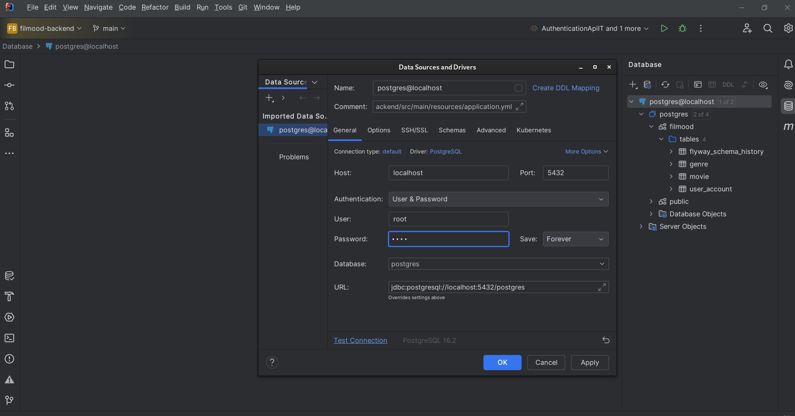

# filmood-backend
Backend for FilMood app

## Setup tutorial

### Tools

1. <a href="https://www.jetbrains.com/lp/general-leaflets/students/">Install IntelliJ (student license)</a>
2. <a href="https://docs.docker.com/engine/install/">Install Docker engine (Linux only)</a>
3. <a href="https://docs.docker.com/desktop/setup/install/windows-install/">Install Docker desktop</a>
4. <a href="https://www.jetbrains.com/help/idea/sdk.html#jdk-from-ide">Install Java 17 Amazon Corretto 17.0.10 inside IntelliJ</a>
5. I suggest PC restart after completing steps above

### Project

1. Clone this repository
2. Open IDE, Open project -> Find and select filmood-backend folder
3. Wait until it loads all dependencies
4. If some suggestions like annotation processing and connect to database show up, apply them (if connecting to DB is not automatic, then follow steps below related to DB)
5. Go to File -> Project Structure -> Project -> Make sure Java 17 Amazon Corretto 17.0.10 is selected as SDK (if not, select it)
6. Run docker images (inside of IDE) - Open terminal in IDE (one of the icons in the bottom left) - type in <strong> docker-compose up -d </strong> (if on linux use sudo)
     <strong> NOTE: Remember to turn off docker after you are done with "docker-compose down" command (sudo if linux). Also, you must turn them on every time before running the app (Run them once on start, stop them after you are done with everything).  </strong>
7. Connect to postgres DB in IDE (connection with DB works only when docker images are running) - click on database icon on right hand side, click on + (if postgres@localhost is already shown in list, right click on it and select properties), copy all values from screenshot below (from General part only, name and description if pre-filled are irrelevant and should stay as they are). 
   <strong> Password is root. </strong>         

8. Click on test connection to make sure everything is ok. Exit the window.
9. Click on refresh icon in Database section menu.
10. Select postgres@localhost, click on numbers 1 of 4 next to "postgres" (if not shown, click on numbers next to postgres@localhost and check postgres), expand postgres and check "filmood". This will allow you to manually edit database (insert values etc.). To insert values, under filmood, expand tables and double click desired table. Menu which shows up displays all entities persisted in database for that specific table. If you want to add new, click on +, fill all fields (field named id is UUID version 4 which must be unique for each entity in table and can be generated using some UUID v4 online generators. Time and boolean fields have interactive option to select values when you insert them (for example, if you click enter on createdAt field in any table, menu shows up with time info to be modified and added, which eases up the process)). When you are done with fields filling, <strong> click on green arrow pointed up to persist entity to database </strong>.
   <strong>   NOTE: Tables are only visible after you run application because database migrations are executed on application startup. So, part related to inserting new values can be done only after application is run at least once. Each time you restart pc, this process resets. Values can be inserted when app is not running, but docker must be running and database migrations must be applied (in other words, application is started (applies migrations) and stopped before inserting values in DB in that case. Of course, you can also insert values in database when app is running). If you have followed all steps and still don't see tables, click on refresh. Sometimes filmood and postgres sections in database tab can hide by itself, so you need to repeat process from 10. to unhide them. </strong>
11. Double click CTRL key, type in and run these 2 commands separately (if it doesn't do anything after 2x ctrl, go to m (Maven) sign on right side of IDE, then select Execute Maven Goal icon and Maven terminal should be shown):
    - mvn clean install -DskipTests 
    - mvn clean verify
12. On top left of the IDE select Project icon, select filmood-backend, go to src/main/java, right click on FilmoodApplication and select Run. IntelliJ should also create Run shortcut which you can use for repetitive running (Green play icon). To stop the app, click on any red square you see.
13. When app is running, you can check available endpoints in browser using Swagger UI by typing <a href="http://localhost:8080/swagger-ui">localhost:8080/swagger-ui</a>

